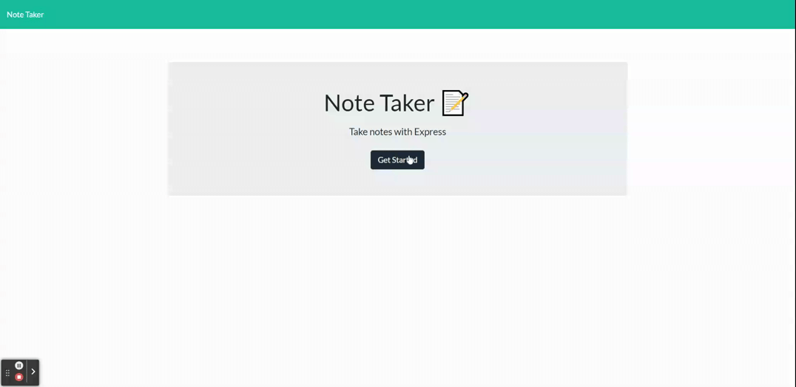

  #  Note Taker 

  ## Description:

This is a full stack app that is deployed on heroku. It is a note taking app. The user can see a list of notes they have previously submitted. They will be able to reference them and also delete them. New notes can be submitted by clicking the "+" and then filling the note title and note text field. Clicking the floppy saves the note. Clicking the trashcan next to the name removes it. The notes are saved onto a db.json file.

  ## Table of Contents:
  * [Description](#Description)

  * [Installation Instructions](#Installation)

  * [Usage](#Usage)
  
  * [License](#License)

  * [Contributors](#Contributors) 

  * [Test Instructions](#Test_Instructions)

  * [Website](#Website)

  * [Technologies-Used](#Technologies-Used)
  
  * [Questions](#Contributors)
    
  ## Installation
    download the project and npm i. Node.js needs to be installed to be able to use it locally.  

  ## Usage
    Node server.js

  ## License:
  This project is covered under the following license. See link for more information.
  If empty, no license is being used.
    
    None
    

  ## Contributors: 
    Myself

  If you would like to contribute please follow:

    No neccessary.

  ## Test Instructions:
    None

  ## Website:
  Github Repository: https://github.com/PRicoSaint/NoteTaker

  Deployed Site here: 

  https://powerful-lake-32811.herokuapp.com/

  Screenshot:
  

  
  ## Technologies-Used:
  
    HTML
	CSS
	Javascript
	node.js

## Any questions/suggestions/critique?
Please find me at:
https://github.com/PRicoSaint/

I can be contacted through email:
santosesteban09@gmail.com

